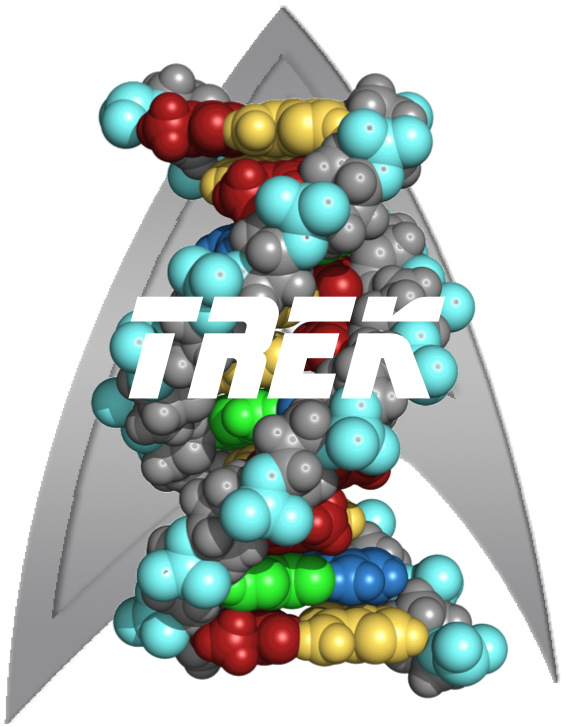

---
html_document:
  highlight: tango
output: html_document
pdf_document: default
word_document: default
---

# Trek: a program to retrieve context-dependent core substitution rate constants (Homo sapiens) for DNA sequences and entire genomes



The \textsc{Trek} methodology is described in detail at <http://dx.doi.org/10.1101/024257>. The name of the package reflects on the fact that we obtained the **Tr**ansposon **E**xposed **k** rate constants (byr$^{-1}$), using the genomic *treks* of retrotransposon remnants in the human genome. 

## Installation

**1.** Install the latest version of R programming language or skip to the next step. Some step-wise instructions on R installation and upgrade can be found here: [1](http://alexonscience.blogspot.co.uk/2015/10/installing-r-on-linuxunix-machines-from.html), [2](http://alexonscience.blogspot.co.uk/2015/10/upgrade-r-environmentlibraries-mac-osx.html).

**2.** Launch R from the command line and install the R packages *shiny* (required for the graphical user interface), *doMC*, *foreach* and *itertools* (required for a parallel execution of the program) from within R.

```{bash, tidy=TRUE, echo=TRUE, eval=FALSE}
$ R
```
```{r, tidy=TRUE, echo=TRUE, eval=FALSE}
> install.packages("shiny")
> install.packages("doMC")
> install.packages("foreach")
> install.packages("itertools")
```

**3.** Download the \textsc{Trek} source code from the [github](https://github.com/aleksahak/Trek) repository. You can also do that via a Linux/Unix/OSX command line, given that git is installed, by typing the following:

```{bash, tidy=TRUE, echo=TRUE, eval=FALSE}
$ git clone https://github.com/aleksahak/Trek
```

The downloaded folder has the following content:

- **lib/** - the subfolder containing all the source files,
- **TrekGUI/** - the subfolder containing the graphical user interface, 
- **Trek.R** - the interfacing R script used to execute \textsc{Trek} from command line.

**4.** Finally, you need to bit compile the package by going into the **lib/** subfolder and  executing **bitcompile.R** code from within R.

```{bash, tidy=TRUE, echo=TRUE, eval=FALSE}
$ cd lib/
$ R
```
```{r, tidy=TRUE, echo=TRUE, eval=FALSE}
> source("bitcompile.R")
```

This generates a single file, **Trek.lib**, which encapsulates \textsc(Trek) and all its dependencies. At this stage, the subfolder **lib/** can be safely removed. You might, however, want to copy the **test.fasta** file from inside **lib/**, in order to test the \textsc{Trek} installation.

Now, the \textsc{Trek} installation folder should contain:

- **Trek.lib** - the bit-compiled \textsc{Trek} program,
- **TrekGUI/** - the subfolder containing the graphical user interface, 
- **Trek.R** - the interfacing R script used to execute Trek from command line,

and, if the test sequence file is preserved,

- **test.fasta** - the example DNA sequence fasta file.

## Running Trek from R

\textsc{Trek} can be executed as an R program, either from within R, or from the Linux/Unix/OSX command line through R CMD BATCH or Rscript execution. The latter two options allow the usage of \textsc{Trek} from the scripts written via programming languages other than R.

In R, as exemplified in the **Trek.R** interfacing script, one should load the **Trek.lib** bit-compiled file, then execute \textsc{Trek} via the R function *Trek()*. The latter accepts four arguments:

- *FastaFile* - the relative or absolute path to the fasta file to analyse,
- *OutFile* - the relative or absolute path to the output file to be saved,
- *MutRates* - an argument accepting "sym" and "nosym" options for the strand-symmetrised (recommended) and raw parameter usage for substitution rates, 
- *nCPU* - the number of CPUs to be used for the calculation, where the larger values can markedly speed up the mapping process for entire genomes.

Alternatively, the **Trek.R** file can be edited to set the desired arguments, and executed from the command line via R CMD BATCH or Rscript.

## Running Trek from a GUI

\textsc{Trek} features a browser-based graphical user interface (GUI), written with Shiny that can be executed locally on as many CPUs as desired. To launch the GUI, enter the **TrekGUI/** subfolder and double click on **TrekGUI** file. If the file fails to open a browser, make sure that the permissions are correctly set for the file (as executable):

```{bash, tidy=TRUE, echo=TRUE, eval=FALSE}
$ cd TrekGUI/
$ chmod 700 TrekGUI # May require sudo rights.
```

If double clicking on **TrekGUI** does not launch your browser after the above step, then, most probably, your Rscript utility of R is not installed on the default */usr/bin/Rscript* path. To correct the TrekGUI setup, first find out the installed path for Rscript by typing from the command line:

```{bash, tidy=TRUE, echo=TRUE, eval=FALSE}
$ which Rscript
```

then open the **TrekGUI** executable file via a usual plain text editor and correct the Rscript path stated at the first line.

Now double click on **TrekGUI**. As soon as the browser opens, the rest is self explanatory.

## License

You may redistribute the \textsc{Trek} source code (or its components) and/or modify/translate it under the terms of the GNU General Public License as published by the Free Software Foundation; version 2 of the License (GPL2). You can find the details of GPL2 in the following link: <http://www.gnu.org/licenses/gpl-2.0.html>.

Questions and bug reports to Aleksandr Sahakyan via [as952 *at* cam *dot* ac *dot* uk].
